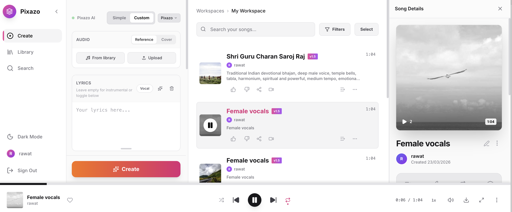

<p align="center">
  
</p>

<h1 align="center">Free AI Music Generator</h1>

<p align="center">
  <strong>The Best Free & Open Source Alternative to Suno.ai</strong><br>
  <em>Generate unlimited AI music with custom lyrics, styles & prompts — powered by <a href="https://www.pixazo.ai">Pixazo AI</a></em>
</p>

<br>

<p align="center">
  
</p>

---

## Free Create Music — Get Your Pixazo API Key

Start generating AI music for free in minutes:

1. Go to [pixazo.ai](https://www.pixazo.ai) and sign up for a free account
2. Navigate to **API Keys** in your dashboard
3. Click **Create API Key** — it's free, no credit card required
4. Copy your key and paste it into `server/.env` as `PIXAZO_SUBSCRIPTION_KEY`
5. Run the app and start creating unlimited music!

> **No usage limits on the free tier.** Generate as many songs as you want with custom lyrics, styles, and prompts.

---

## Why This Over Suno?

| | Suno.ai | This Project |
|---|---------|-------------|
| **Price** | $10+/month | Free |
| **Song limit** | 50/month (free tier) | Unlimited |
| **Open source** | No | Yes |
| **Custom lyrics** | Yes | Yes |
| **API access** | Paid | Included |
| **Self-hosted** | No | Yes |

## Features

- **Simple & Custom modes** — describe what you want or fine-tune every detail
- **Custom lyrics** — write your own or go instrumental
- **Reference & Cover audio** — upload audio for style transfer
- **Song library** — browse, search, like, and organize into playlists
- **Share anywhere** — Twitter, Reddit, WhatsApp, Telegram, LinkedIn
- **User profiles** — avatars, bios, followers
- **Dark / Light theme** — fully responsive mobile layout
- **Multi-language** — English, Chinese, Japanese, Korean

## Tech Stack

| Layer | Technology |
|-------|-----------|
| **Frontend** | React 18 + TypeScript, Tailwind CSS |
| **Backend** | Express.js + TypeScript |
| **AI Engine** | [Pixazo Tracks API](https://www.pixazo.ai/models/tracks) |
| **Database** | SQLite |
| **Auth** | JWT (local session) |

## Quick Start

### 1. Clone

```bash
git clone https://github.com/<your-username>/free-ai-music-generator.git
cd free-ai-music-generator
```

### 2. Install

```bash
# Frontend
npm install

# Backend
cd server
npm install
```

### 3. Configure

Create `server/.env`:

```env
PORT=3001
NODE_ENV=development

# Pixazo API — get your free key at https://www.pixazo.ai
PIXAZO_API_URL=https://gateway.pixazo.ai
PIXAZO_SUBSCRIPTION_KEY=your-key-here

AUDIO_DIR=./public/audio
FRONTEND_URL=http://localhost:5173
JWT_SECRET=your-secret-here
```

### 4. Run

```bash
# Terminal 1 — Backend
cd server
npm run dev

# Terminal 2 — Frontend
npm run dev
```

Open [http://localhost:5173](http://localhost:5173) and start creating music!

## How It Works

```
You describe a song
  → Express server sends request to Pixazo Tracks API
    → AI generates the music in the cloud
      → Audio downloaded & saved locally
        → Play, share, or download your song
```

## Project Structure

```
├── App.tsx                    # Main app
├── components/                # React UI components
│   ├── CreatePanel.tsx        #   Music generation form
│   ├── SongList.tsx           #   Song library
│   ├── Sidebar.tsx            #   Navigation
│   └── PlayerBar.tsx          #   Audio player
├── services/api.ts            # API client
├── i18n/                      # Translations (EN/ZH/JA/KO)
├── server/
│   ├── src/
│   │   ├── index.ts           #   Express server
│   │   ├── services/acestep.ts #  Pixazo API integration
│   │   ├── routes/            #   REST endpoints
│   │   └── db/                #   SQLite
│   └── .env                   #   Configuration
└── docs/
    └── screenshot.png
```

## Keywords

AI music generator, free Suno alternative, open source music AI, text to music, AI song generator, Suno.ai alternative, free music generation, Pixazo, AI lyrics to song

## License

MIT
